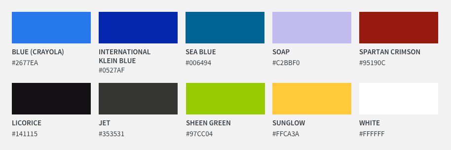

= Metanorma styling for NIST

== Color palette

This color palette is generated from the two colors used by NIST:

* `#2677EA` the newest blue color used with the NIST logo
* `#0527AF` a previously used shade for the NIST logo (a bit of the 90's)

[cols="1,1"]
|===

|BLUE (CRAYOLA) | 2677EA
|INTERNATIONAL KLEIN BLUE | 0527AF
|SEA BLUE | 006494
|SOAP | C2BBF0
|SPARTAN CRIMSON | 95190C
|LICORICE | 141115
|JET | 353531
|SHEEN GREEN | 97CC04
|SUNGLOW | FFCA3A
|WHITE | FFFFFF

|===

